# Defending Excess level policy with GCP Policy Analyzer and Asset Inventory.

With great power comes great responsibility same stand for a policy written with care then it's good for everyone otherwise if a policy is given too much it can be useful for hackers to exploit and gain access to your computer. Because of the same reason, we can check if our application doesn't have permissions that are harmful and publicly available.

To check the policy we use Policy Analyzer a native GCP (Google Cloud Platform) tool which lets you find out which principals (for example, users, service accounts, groups, and domains) have access to which Google Cloud resources based on your IAM allow policies.

Furthermore, the details for that resources can be found on a single tool known as Asset Inventory which provides inventory services based on a time series database. This database keeps a five-week history of Google Cloud asset metadata. Overall it allows us to analyze IAM policy to find out who has access to what.

### Solutions:

**Step 1:** Open the web application.

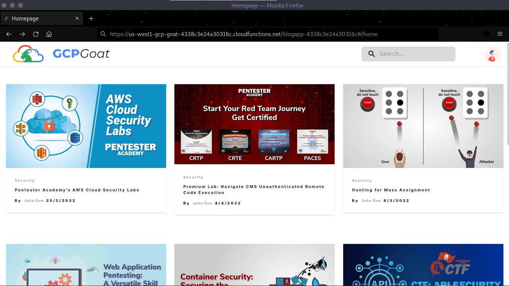

**Step 2:** Now, right-click on the blog and click on "Open image in New Tab".

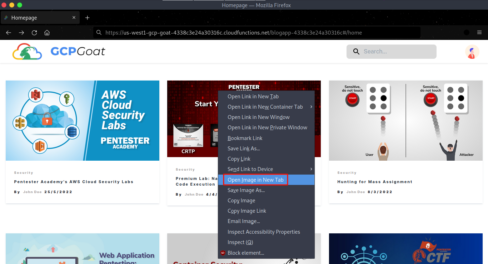

**Step 3:** Here you find that the image is being fetched from a google storage bucket.

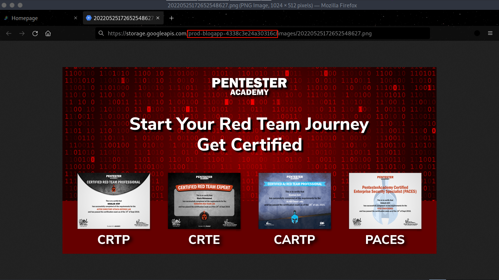

You can find the name of the bucket as highlighted in the above image, after the storage.googleapis.com. Take note of this name.

**Step 4:** Replace prod with dev and see if you get the same image.


As we can see the dev URL is publically available and whose storage name is similar to prod.

**Step 5:** Use the below URL to find out all the permissions you have on this bucket.

```
https://www.googleapis.com/storage/v1/b/BUCKET_NAME/iam/testPermissions?permissions=storage.buckets.delete&permissions=storage.buckets.get&permissions=storage.buckets.getIamPolicy&permissions=storage.buckets.setIamPolicy&permissions=storage.buckets.update&permissions=storage.objects.create&permissions=storage.objects.delete&permissions=storage.objects.get&permissions=storage.objects.list&permissions=storage.objects.update
```

**Note:** replace BUCKET_NAME with your current bucket name.

The Google Storage TestIamPermissionsAPI allows us to supply a bucket name and list of Google Storage permissions, and it will respond with the permissions we have on that bucket.

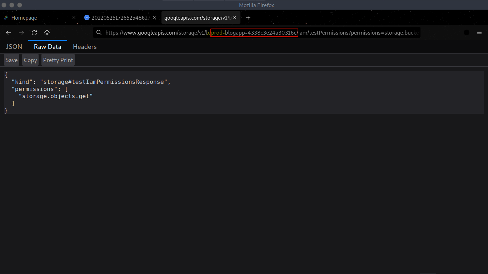

This bucket only has read access which is "storage.buckets.get". But it is the prod bucket now see for the dev bucket also.

**Step 6:** List out all the permissions we have on the dev bucket.

```
https://www.googleapis.com/storage/v1/b/BUCKET_NAME/iam/testPermissions?permissions=storage.buckets.delete&permissions=storage.buckets.get&permissions=storage.buckets.getIamPolicy&permissions=storage.buckets.setIamPolicy&permissions=storage.buckets.update&permissions=storage.objects.create&permissions=storage.objects.delete&permissions=storage.objects.get&permissions=storage.objects.list&permissions=storage.objects.update
```

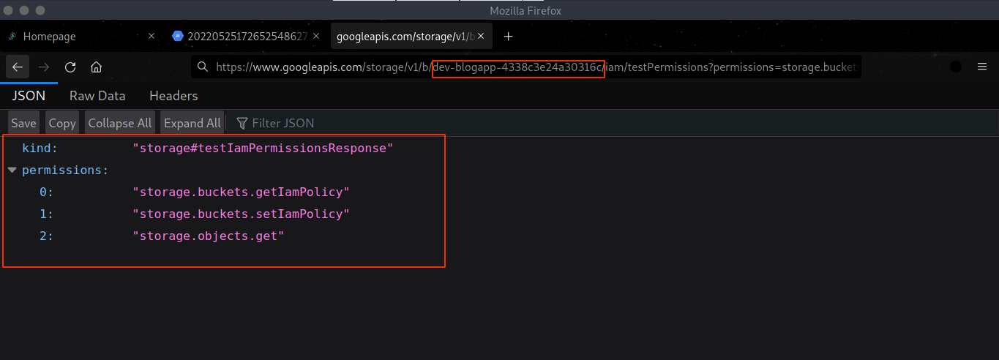

Here we have two excessive permission along with the get permissions.

* storage.buckets.setIamPolicy - This grants permission to set IAM policies in the bucket.
* storage.buckets.getIamPolicy - This grants permission to read IAM policies in the bucket.

**Step 7:** Here seeing excessive permission available on the internet means we missed something important in the testing, for that we can use policy analyzer to check the policy.

One thing you can do is search "Policy Analyzer" or you can also get it in the "IAM and admin" section as the given figure below:

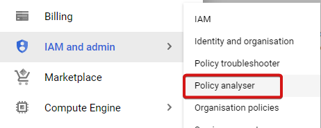

**Step 8:** Then we will create a custom query to get, what resource is getting internet access.

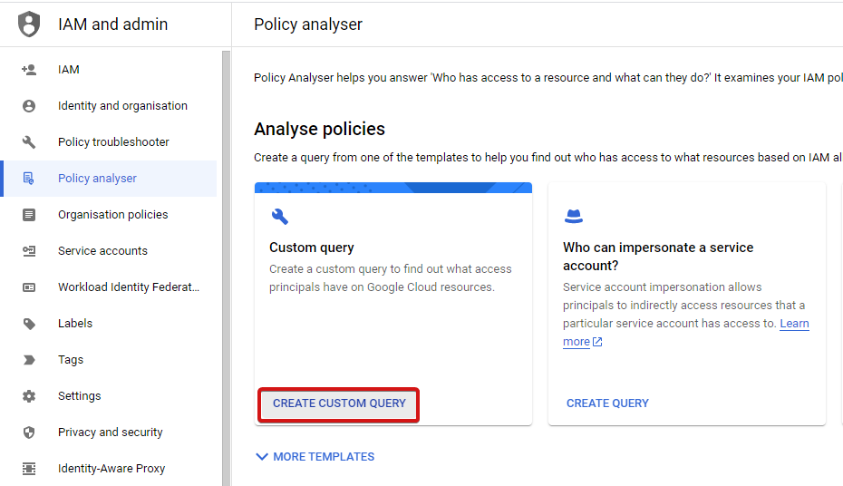

**Step 9:** So to know which is getting internet access we will set principal to found is All users select it and continue.  

**Note:** The value allUsers is a special identifier that represents anyone who is on the internet, including authenticated and unauthenticated users.

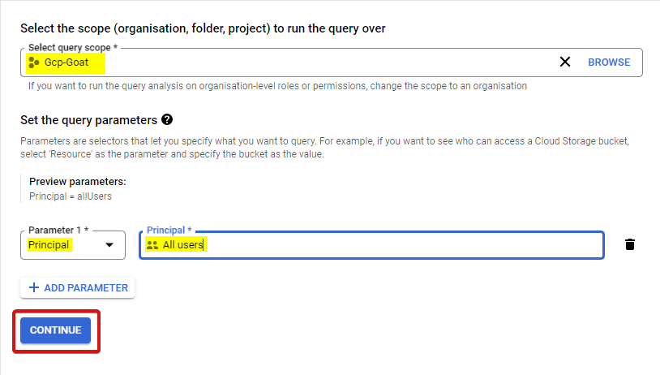

**Step 10:** After that, we set up the advanced setting for the query

In this, we select for the list the resources which match the query because we want to know which resources is having internet access.

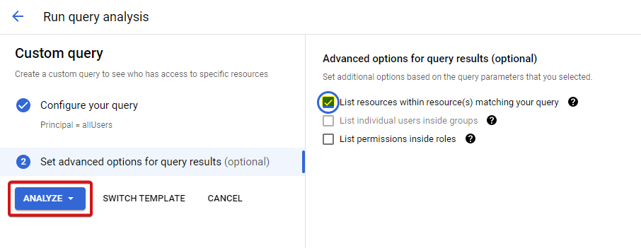

**Step 11:** Then click on the analyze button and click on run the query as shown below image:

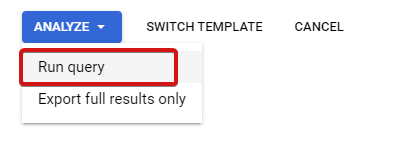

**Step 12:** And we get 6 outputs of which 2 are custom roles and we will try to see if the roles are having access to which things.

Out of that six results three are roles by google in which 2 are for cloud function invocation, one is given to the viewer of the storage bucket and the last one is to grants permission to view objects and their metadata, excluding ACLs (storage.legacyObjectReader).

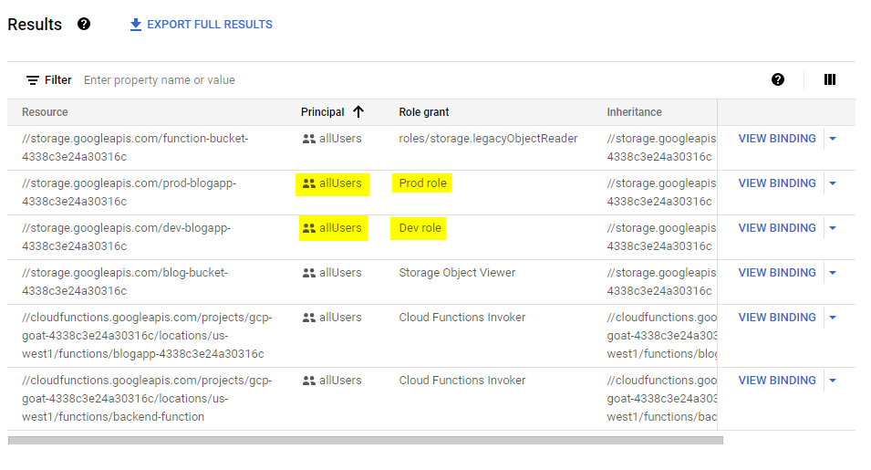

**Step 13:** On the same page we can see Asset inventory in "IAM and admin" again you can also search for it.


**Step 14:** In assert inventory, we will go to the resource section as we got two custom roles that lie in the resources.

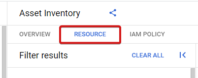

**Step 15:** To get what we want we have to click to view more to get the roles because in the given list roles are not visible.

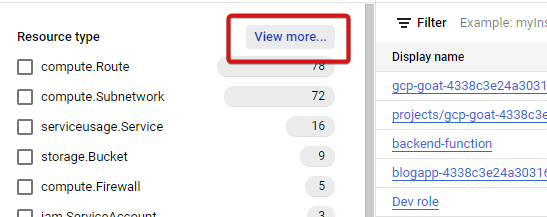

**Step 16:** After clicking on view more we can search for iam.Role to get all custom roles select it and go for apply as shown in the image.

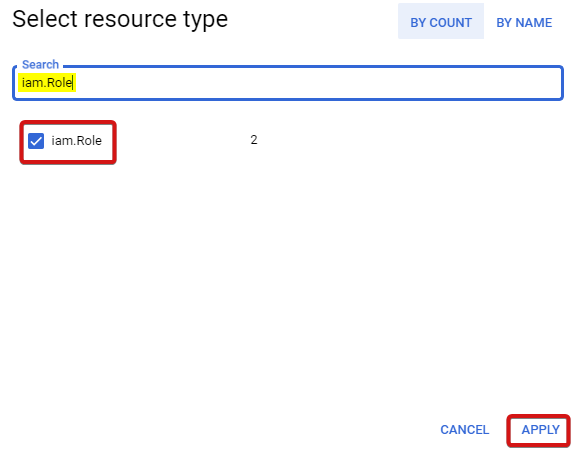

**Step 17:** There we can again see both the roles "Dev role" and "Prod role"

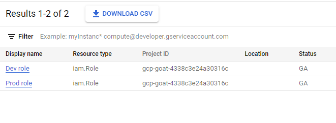

**Step 18:** We inspect the Prod role.

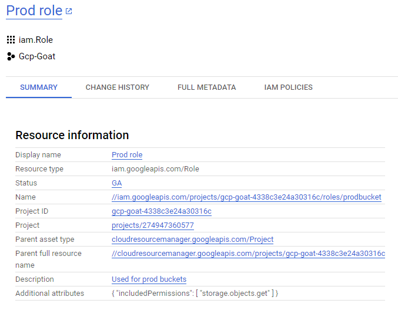

In the resource information and additional attributes, we can see that the permission given to the role is to just get the storage object. But when we change the URL from prod to dev we see some excessive roles which is not this one.

Click on the next to see the next assert inventory result means "Dev role"

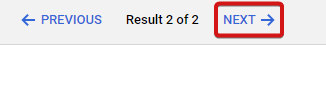

**Step 19:** Here we get the "Dev role"

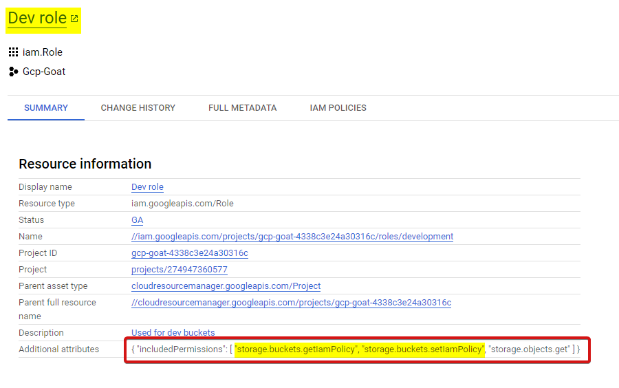

In the resource information and additional attributes, we see that the permission given to the role is excessive and dangerous as it is available on the internet plus the permission is from iam get and set which could eventually lead a hacker to get access to the Storage bucket or environment too if anything is not safe in the bucket.

**Step 20:** Now we will restrict the dev role to have that permission so no one can set and get the policy. For the same go to the IAM role on the same page or again you can also search it.


**Step 21:** We will select the Dev role

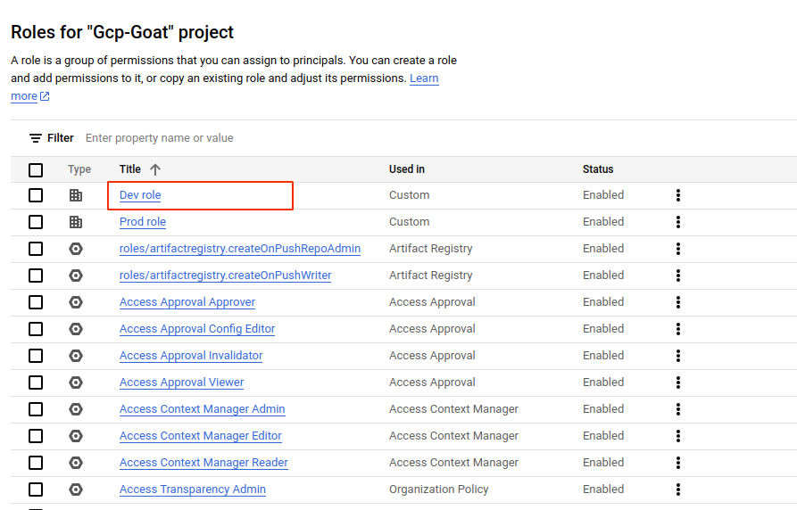

We can see the three assigned policies.

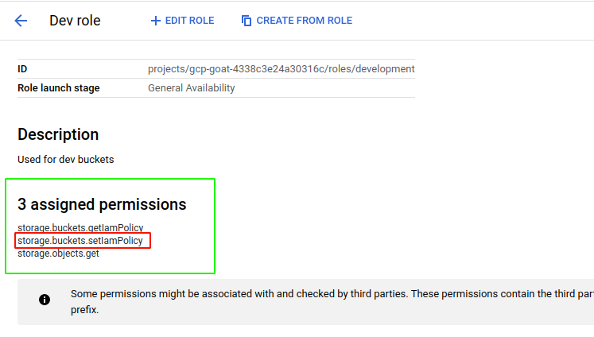

**Step 22:** Click on Edit Role.

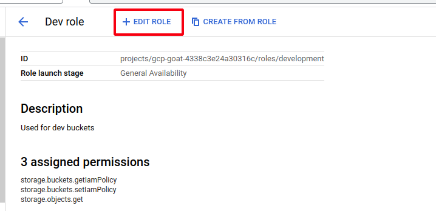

Uncheck the first two marked permission as shown in the below image.

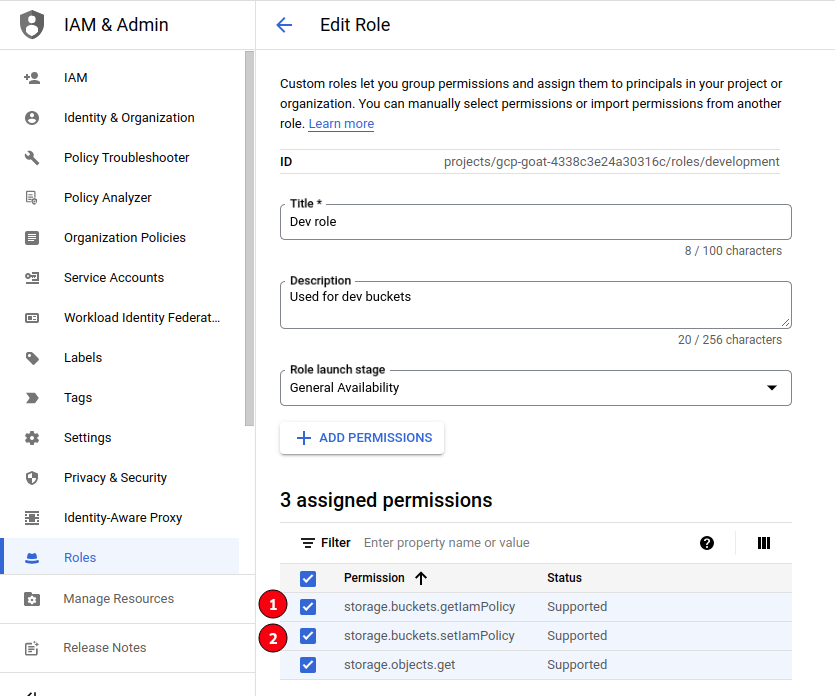

So it will be restricted to be usable as well as non-risky.

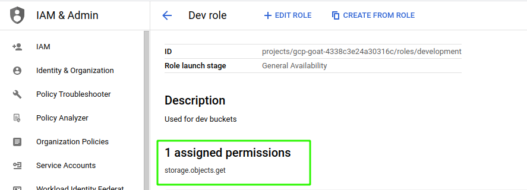

**Step 23:** Go back to the listed permission for dev-bucket and click on the Refresh button.

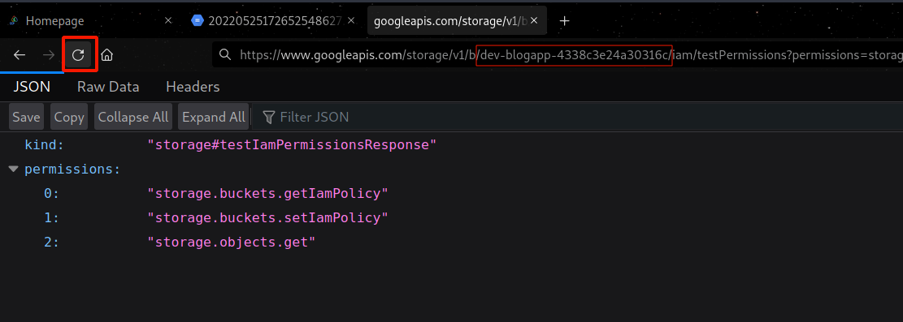

You will notice no overly excessive permission are available for that bucket through the internet.

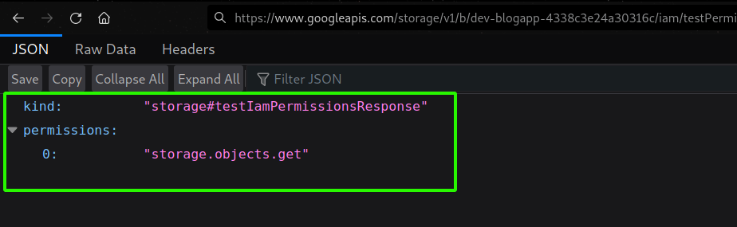

We have properly re-configured our cloud buckets.

But if by assumption we haven't stopped this threat and some user got admin access to the storage by exploiting/using the dev permission so what can we do?

Note: This command will work if both get and set policies are present in dev.

**Step 24:** Give admin-level permission with the gsutil tool.

```
gsutil iam ch allUsers:admin gs://<BUCKET NAME>
```

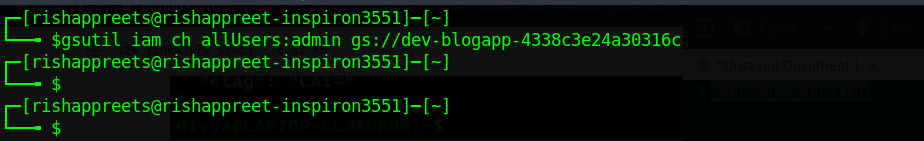

and then the admin user can access the dev bucket directly from the browser

URL should be like

```
https://storage.googleapis.com/<DEV BUCKET NAME>
```

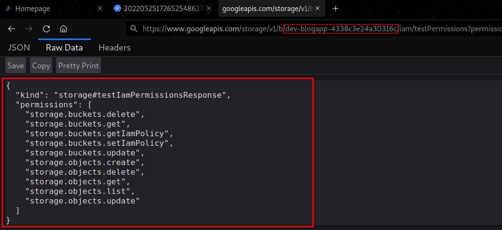

#### Vm attack catch

**Step 1:** List out the content of the dev bucket, that we just compromised from the misconfigured storage bucket.

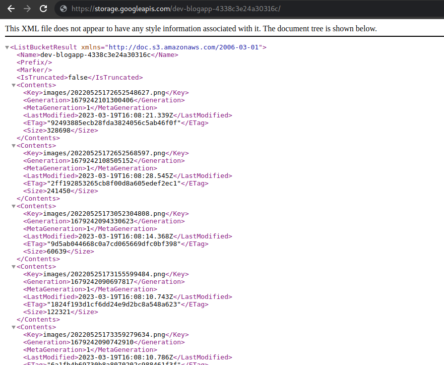

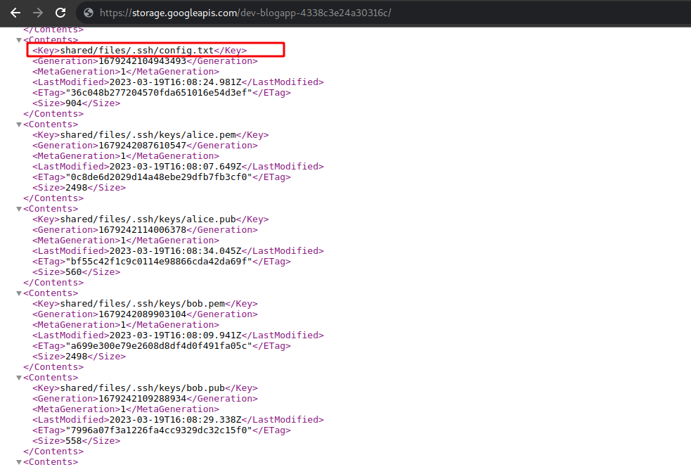

In the bucket contents, you will find an interesting file named **config.txt** as highlighted in the above image. Copy the relative path for the file. There are some key files also in the same directory.

**Step 2:** Access the config.txt file using the relative path at the end of the bucket URL.

```
https://storage.googleapis.com/<DEV BUCKET NAME>/shared/files/.ssh/config.txt
```

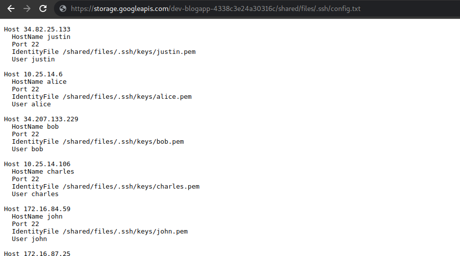

Here you will find multiple IPs with some users and their SSH key relative paths (which is a bad practice to store ssh keys in the cloud as it is the developer can use key management tools like KMS in GCP).

**Step 3:** It is visible that we have some loophole with our buckets but the simple access of ssh keys are scary one normal and major thing to do is not to store these ssh keys openly and store them with tools like GCP KMS, but if your ssh is compromised then vm is easily accessible, So we have to check if any vm have excessive permission with Policy Analyzer.

Open the Policy analyzer in IAM admin and create a custom query as shown in the image.

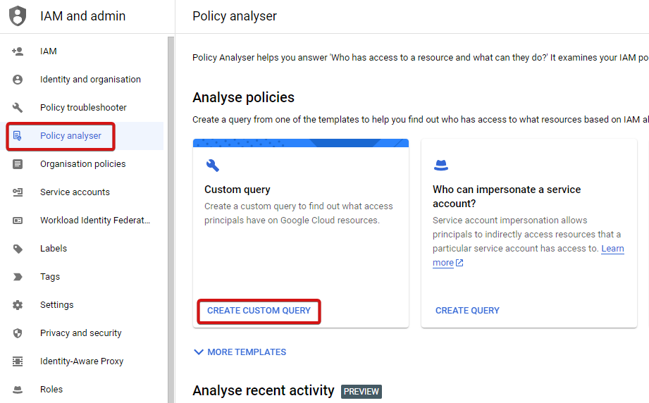

**Step 4:** In the parameters choose a role where the scope is this project as we are going to find who is having owner permission and if it is excessive or not

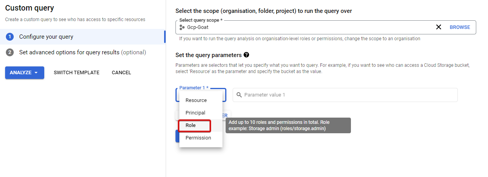

**Step 5:** and put the role as Owner as discussed above.

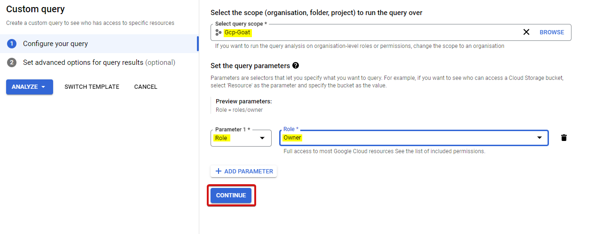

**Step 6:** After that, we set up the advanced setting for the query

In this, we select a list of individual users inside groups to get which users is having owner permission.

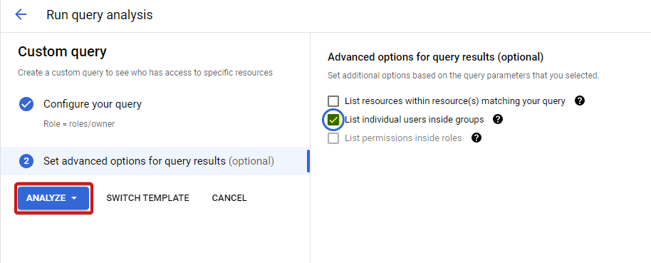

**Step 7:** Then click on the analyze button and click on run the query as shown below image:

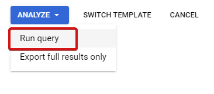

**Step 8:** Here we get two resources who are having Owner level access one is the owner/creator of the project gcpgoat@ine.com which is what it should be, but the other is given to an admin-service-account which is an owner.

But currently, we don't know what this service account is related so we will use assert inventory to know about some things.

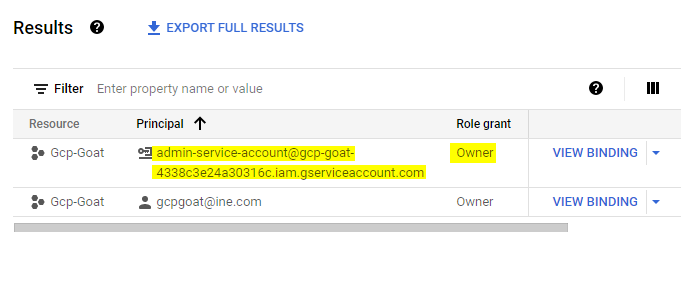

**Step 9:** On the same page we can see Asset inventory in "IAM and admin" again you can also search for it.

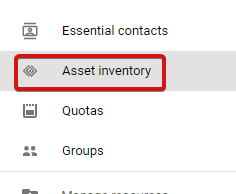

**Step 10:** For the case of service-accounts first mind goes towards two major resource types:
* one is the cloud function
* another one is compute instance

But we don't know whether compute instance is having that role or not. (because we are just checking if there is owner-like permission, it will make our infrastructure non-recoverable if an attacker comes in)

We get 4 resources 2 in cloud function and 2 in compute instances and we will take a look and see if, with any of them, the admin-service-account is attached or not.

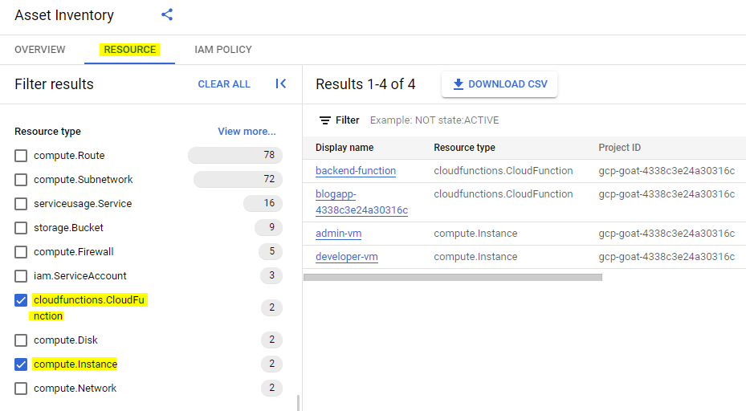

**Step 11:** So we click on the first display name i.e. backend-function there we click on full metadata to get to know which service account it is attached with.

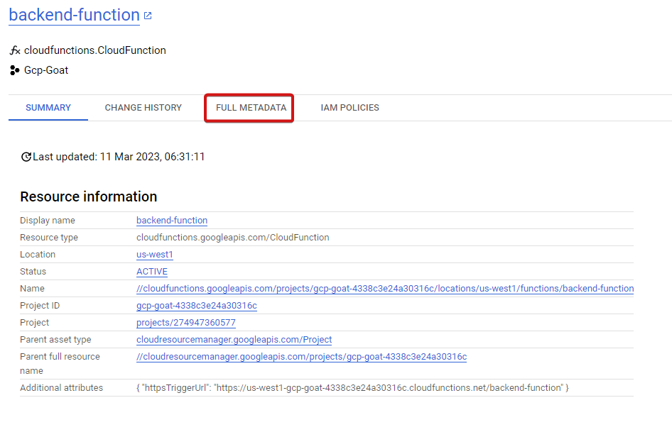

**Step 12:** And in the metadata, we get that it is attached to the gcp-goat named service account so we pass this and go and look for another one.

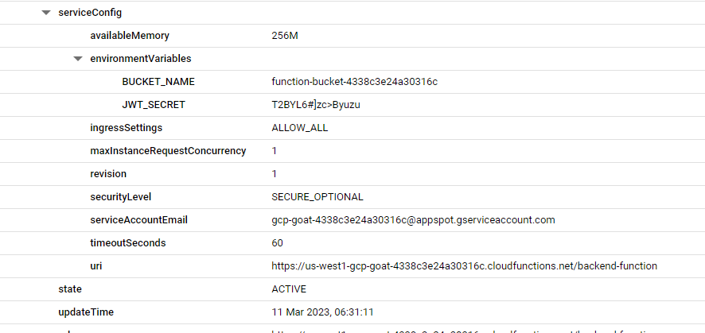

**Step 13:** With the second function named blogapp the case is also the same we get a gcp-goat service account so we pass this one too.

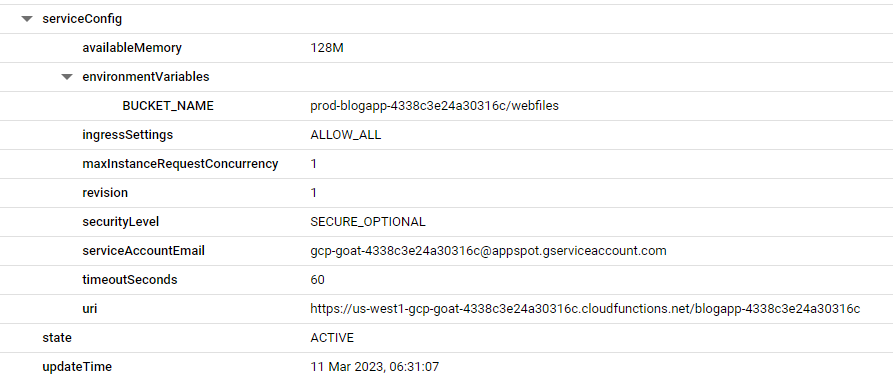

**Step 14:** With the admin-vm instance, in metadata, we see that admin-service-account is attached which is the same service account whose permission is the owner and whose scopes are also platform level which means if anyone got its access can put serious damage to our infrastructure to secure that we will limit its service account access.

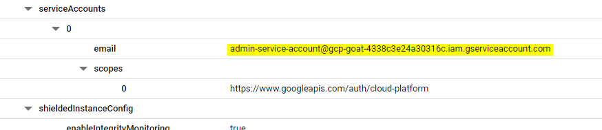

**Step 15:** To do that we will have to go to iam which you can search in the gcp search panel.

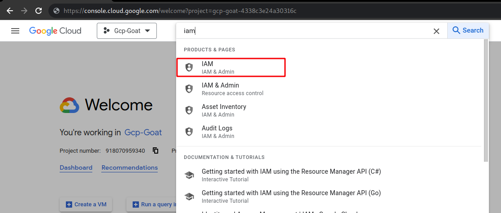

click on IAM


**Step 16:** There we will edit the admin-service-account service account

For edit click on the pencil-like icon as shown in the image.

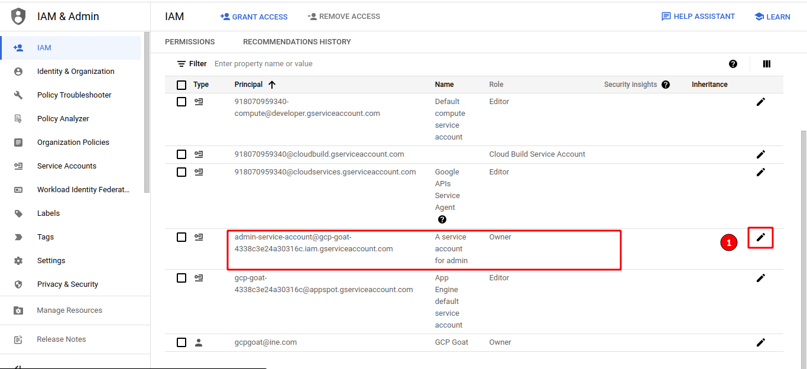

**Step 17:** There we can see the role assigned is the owner and we have to limit it for that click on the owner a drop-down will appear.

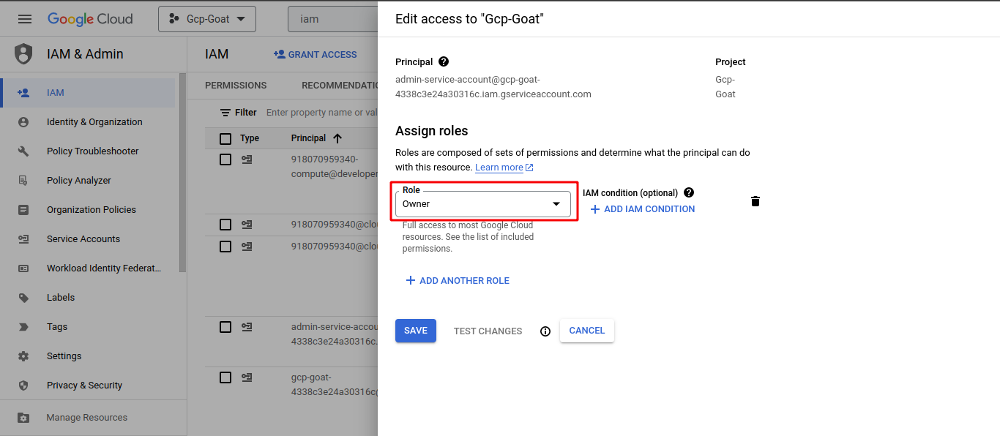

**Step 18:** In the drop-down, there will be a search section. At that place, we write "compute viewer". and Select Compute Viewer.

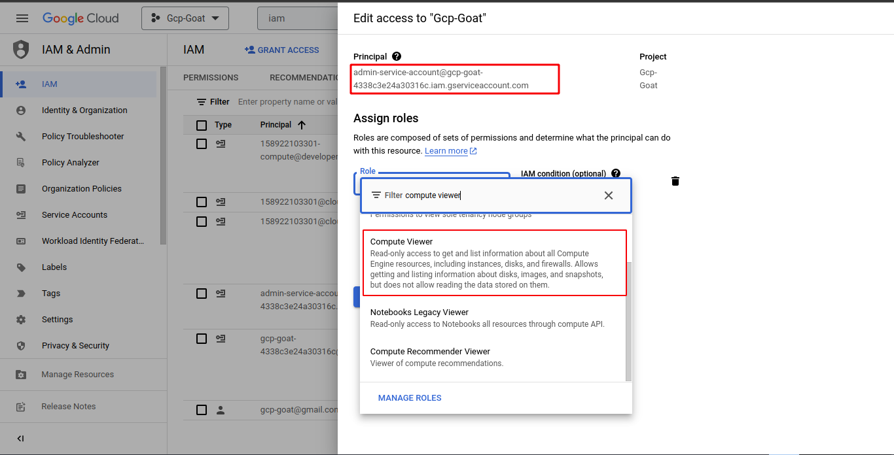

**Step 19:** After that, you can see a summary of changes too on the right-hand side panel. We save the changes.

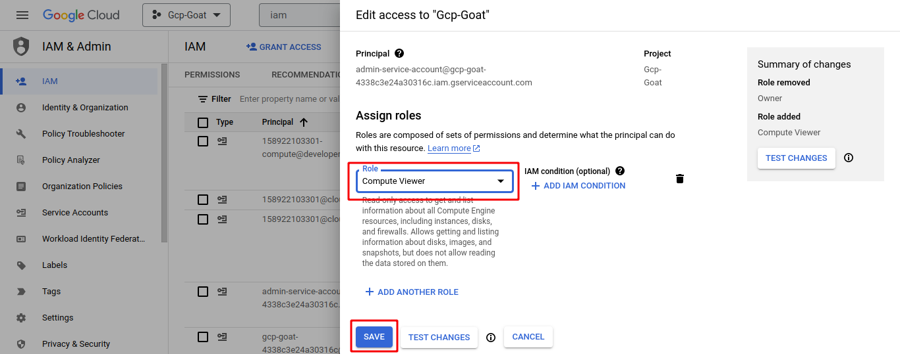

**Step 20:** Now we can check how the permission is working so we will go to vm instances.

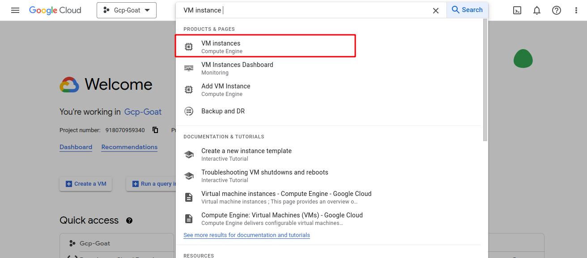

**Step 21:** There we see two instances and we connect to the admin vm with connect with ssh.

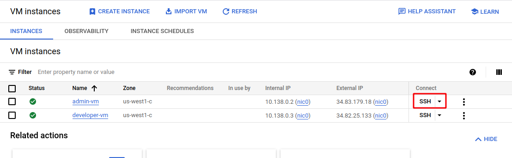

**Step 22:** Now we can list the configuration and confirm that this project is using admin-service-account

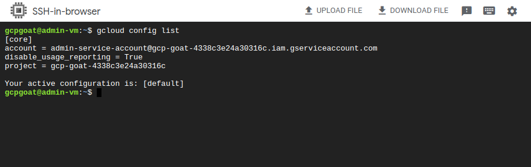

**Step 23:** And we want to get or list the policy for the gcp-goat project which can be easily able to do when it was having owner permission as now permission is restricted it can only do a certain level of damage.

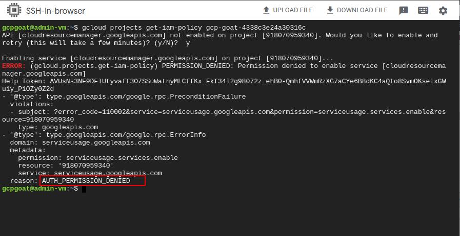

### Further tasks:
* What we can future do is to secure the ssh keys so no one can access it from the internet.
* Make some restrictions that they can't store ssh keys.
* Another thing is to make sure that the scope level policy is minimum to what resources need or make them restricted so no one can just get the whole project level permission scope.
