# Securing GCP Compute Engine with Cloud Custodian Policy

In Google Cloud Platform (GCP), a scope is a way to control access to GCP resources. It is a set of permissions that allows a service account to perform a specific action on a resource. Scopes determine the level of access that an application running on a virtual machine (VM) has to GCP APIs.

It is important to carefully give GCP Compute Engine scopes because granting too many or overly broad scopes to a service account can pose a security risk. By granting a service account too many privileges, an attacker who gains control of the service account can potentially compromise all resources in the associated project.

Moreover, in a shared computing environment, granting too many privileges to one service account can lead to unintentional access to other users' resources, resulting in a data breach or unauthorized activity. Therefore, it is critical to grant only the necessary and minimal privileges required for a service account to perform its intended tasks.

## Overview
Cloud Custodian is an open-source tool that provides a simple and flexible policy engine for managing public cloud infrastructure. It can be used to enforce security and compliance policies, cost optimization policies, and operational policies across multiple cloud platforms, including Google Cloud Platform (GCP).

To learn more about Cloud Custodian and its capabilities, please visit their website at https://cloudcustodian.io/

In order to protect against overly permissive scopes attached to virtual machines in Google Cloud Platform (GCP), we are utilizing Cloud Custodian with a policy. The policy is designed to identify and shut down any GCP instances that have too many privileges, based on the scopes associated with their service accounts. If an instance is found to have either of the following scopes:
- `https://www.googleapis.com/auth/cloud-platform`
- `https://www.googleapis.com/auth/compute`

it will be stopped. Additionally, a notification will be sent to the Cloud Function via a Google Cloud Pub/Sub topic.


## Solution

**Step 1:** Login into the virtual machine that we got the key from the storage account.

**Command:**
```
ssh -i justin.pem justin@<IP address>
```

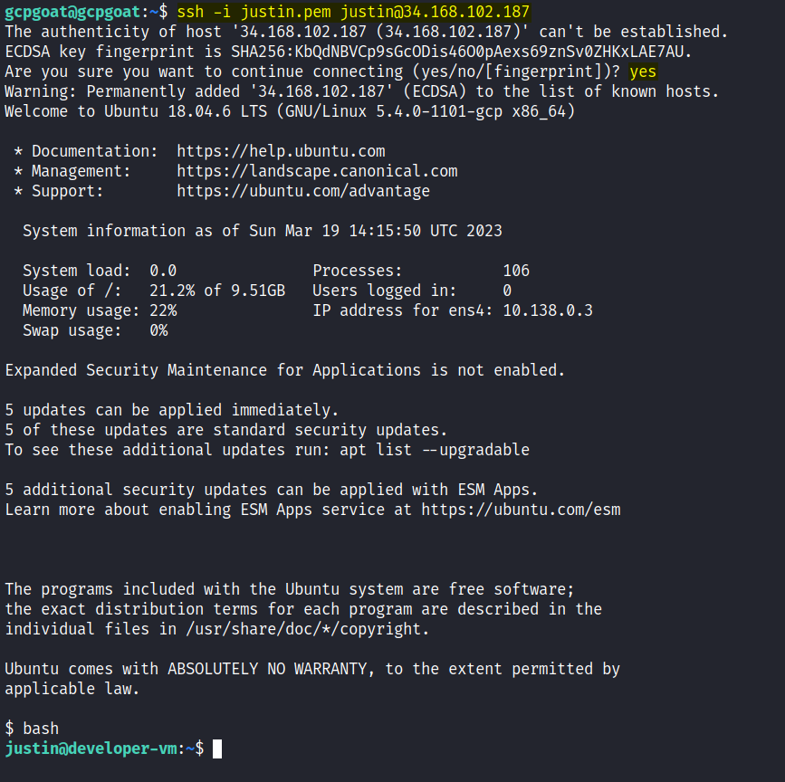

This will log us into the virtual machine using the `justin.pem` key file and the `IP address` of the virtual machine.

**Step 2:** Check the scope of the virtual machine.

**Command:**
```
curl http://metadata.google.internal/computeMetadata/v1/instance/service-accounts/default/scopes \
    -H 'Metadata-Flavor:Google'
```

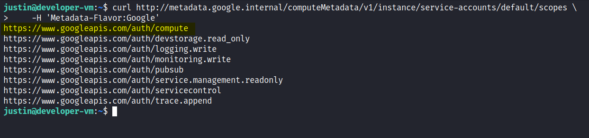

This command will retrieve information about the default service account's scopes associated with the virtual machine. If an attacker gains access to a service account with the `https://www.googleapis.com/auth/compute` scope, they can potentially use this access to move laterally within a GCP environment. For instance, they can use this access to launch additional instances or modify network configurations to gain further access within the environment.

**Step 3:** Use the following command to list all the instances available in the project:

**Command:**
```
gcloud compute instances list
```

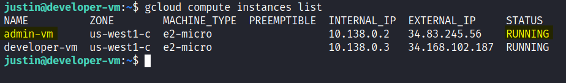

This command will display a list of all the instances in the project, including their name, zone, and state.

Since we have the `https://www.googleapis.com/auth/compute` scope, we can log in to other virtual machines as well.

**Step 4:** Try logging into the **admin-vm** virtual machine by running the following command:

**Command:**
```
gcloud compute ssh admin-vm
```

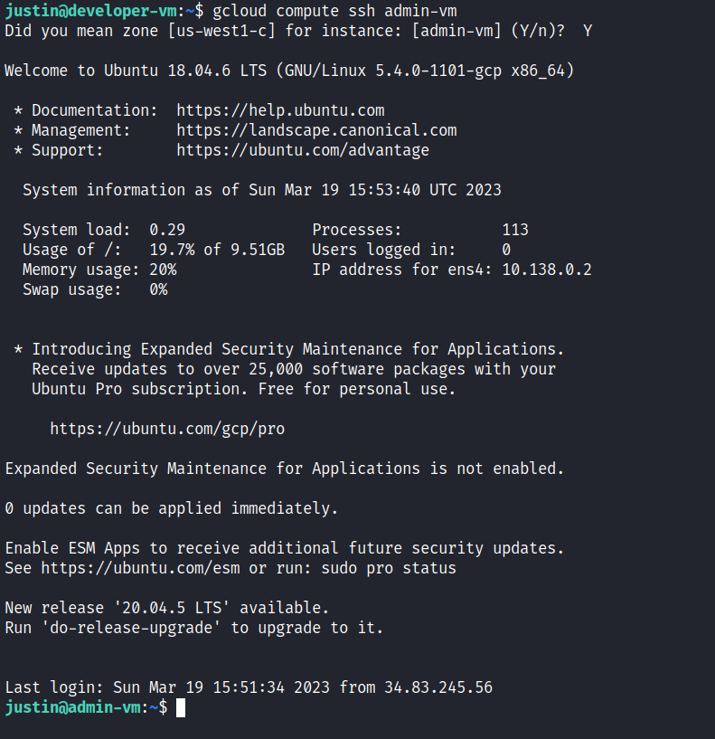

This command will log us into the admin-vm virtual machine.

**Step 5:** Check the service account name attached to the admin-vm virtual machine by executing the following command:

**Command:**
```
curl http://metadata.google.internal/computeMetadata/v1/instance/service-accounts/default/email  -H 'Metadata-Flavor:Google'
```

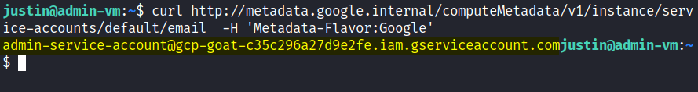

This command will display the email address associated with the default service account of the admin-vm virtual machine.

**Step 6:** Check the role attached with the service account.

**Command:**
```
gcloud projects get-iam-policy <PROJECT NAME>
```


This command will display the IAM policy of the specified project, including the role attached to the service account.

In this case, the role attached to the service account is `roles/owner`.

**Step 7:** Check the scopes attached with this VM.

**Command:**
```
curl http://metadata.google.internal/computeMetadata/v1/instance/service-accounts/default/scopes \
    -H 'Metadata-Flavor:Google'
```

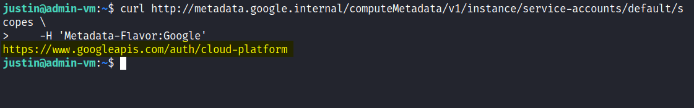

The `https://www.googleapis.com/auth/cloud-platform` scope in Google Cloud Platform (GCP) is a very powerful scope that grants an application or service account broad permissions to manage resources across multiple GCP services. This can potentially lead to privilege escalation.

**Step 8:**  Install Cloud Custodian on your local machine to manage your GCP resources.

To install it on your local machine, follow the steps below:

**Command:**
```
python3 -m venv custodian
source custodian/bin/activate
pip install c7n_gcp
```

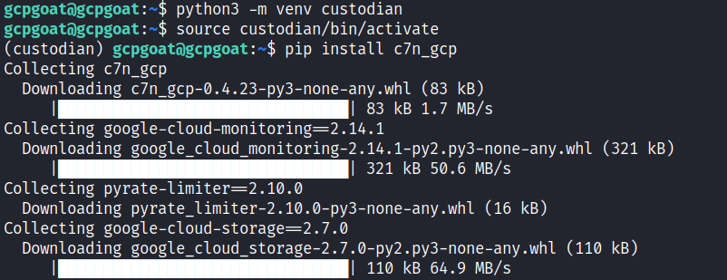

**Step 9:** Authenticate with the GCP services by running the command below.


**Command:**
```
gcloud auth application-default login
```

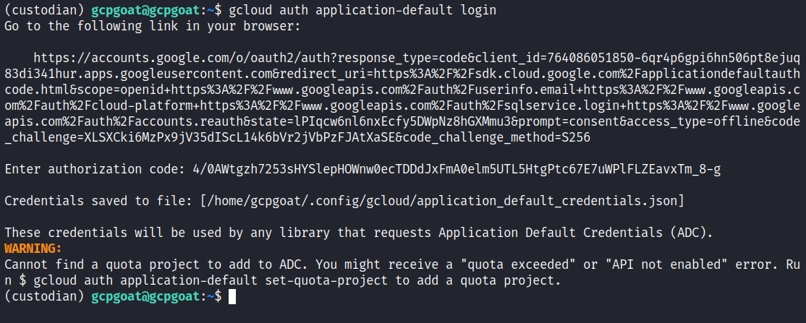

This command will allow you to authenticate with GCP services.

**Step 10:** Create a Cloud Function to receive Pub/Sub notifications.

To get started with creating a new Cloud Function, navigate to the GCP console and search for "Cloud Functions" and click on it. 


**Step 11:** Once you're on the Cloud Functions page, click on **Create Function** button to create new function.


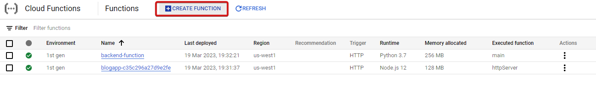

**Step 12:** Configure the Cloud Function.

Choose a name for your function and use **Cloud Pub/Sub** as the trigger type. Click on **Create a topic** button to create a new Pub/Sub topic. 

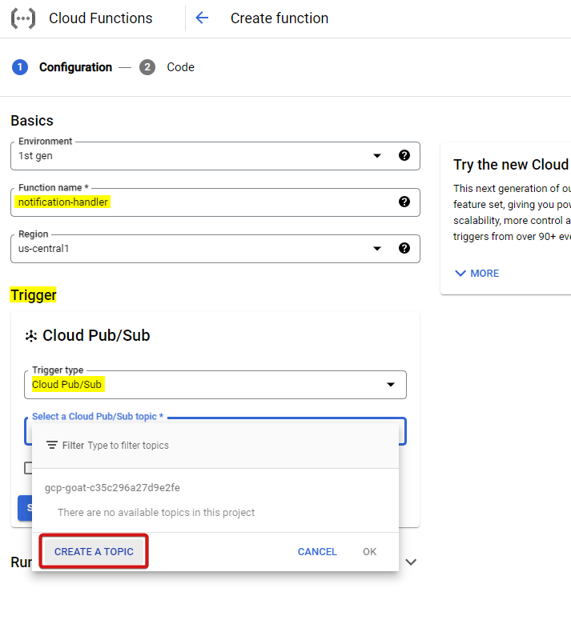

**Step 13:** Give the topic a name and click on **Create** button.

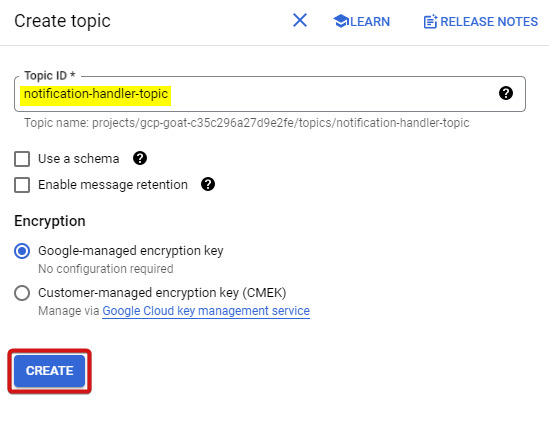

**Step 14:** Click on **Save** button to save the trigger configuration and then click on **Next**.

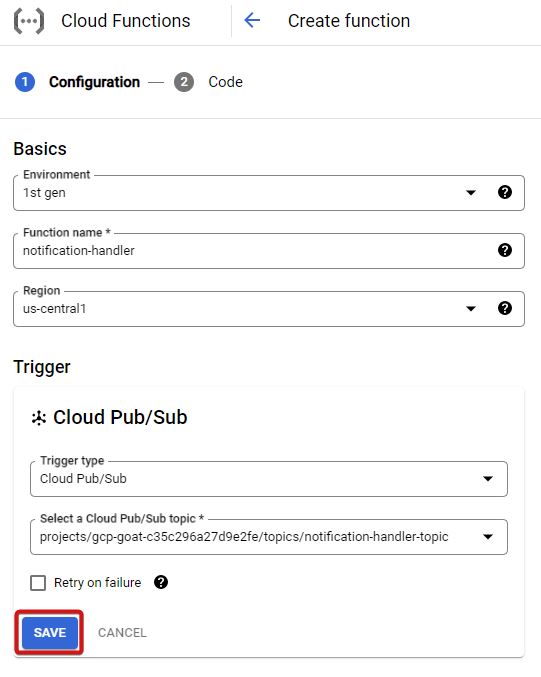

This configuration tells Cloud Functions to listen for messages on the Pub/Sub topic you just created, and to invoke your function when a new message arrives.

**Step 15:** Set up the Cloud Function code and click on **Deploy**.

Set the runtime as **Python 3.8** and set the entry point as **notification** (which is the function name we'll be using for our function). Copy and paste the following code to handle the Pub/Sub message:

**Code:**
```
import base64
import zlib

def notification(event, context):
    decoded_compressed = base64.b64decode(event['data'])
    decompressed = zlib.decompress(decoded_compressed)
    print(decompressed)
```

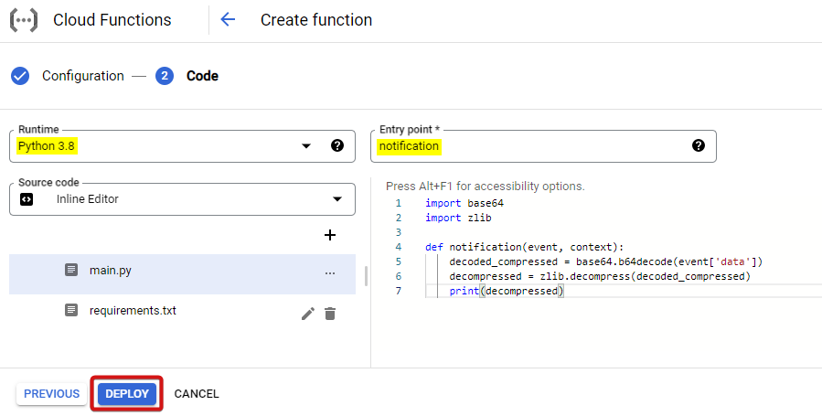

This code will decode and decompress the Pub/Sub message payload, and print the resulting data to the logs.

**Step 16:** Copy the Pub/Sub topic name.

Navigate to the "Trigger" tab of your Cloud Function and copy the Pub/Sub topic name. You will use this name in your Cloud Custodian policy to trigger the function when certain events occur in your GCP environment.

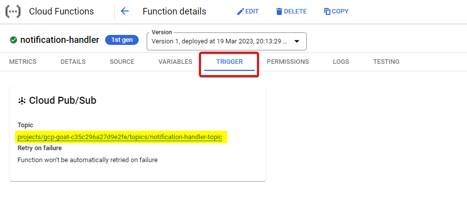

**Step 17:** Create a cloud custodian policy to find and stop the instances which are having the following scopes:

- `https://www.googleapis.com/auth/cloud-platform`
- `https://www.googleapis.com/auth/compute`

Create file named **policy.yml** and paste the following.

```
policies:
  - name: vm-access-control-policy
    description: |
      Shuts down any compute instances that have too many privileges.
    resource: gcp.instance
    filters:
      - or:
        - type: value
          key: serviceAccounts[*].scopes[]
          op: contains
          value: https://www.googleapis.com/auth/cloud-platform
        - type: value
          key: serviceAccounts[*].scopes[]
          op: contains
          value: https://www.googleapis.com/auth/compute
    actions:
      - type: stop
      - type: notify
        subject: Stopped Instance having over privilage scopes
        to:
          - gcpgoat@ine.com
        transport:
          type: pubsub
          topic: projects/gcp-goat-c35c296a27d9e2fe/topics/notification-handler-topic
```

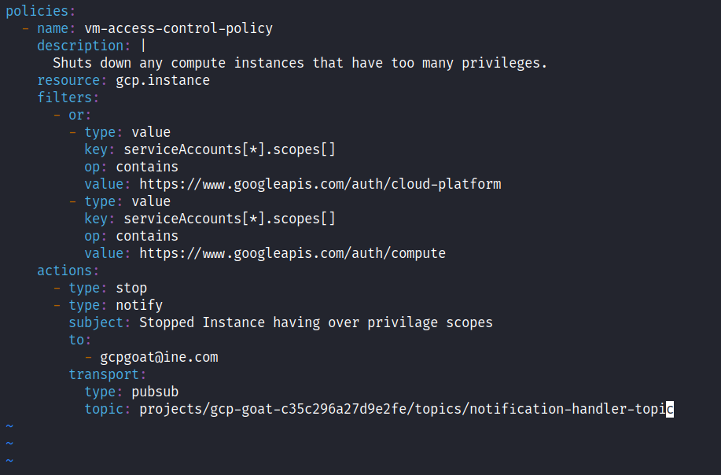

This policy aims to identify and stop compute instances in a Google Cloud Platform (GCP) environment that have excessive privileges, based on their service account scopes. The policy looks for instances with service accounts that have scopes that include "`https://www.googleapis.com/auth/cloud-platform`" or "`https://www.googleapis.com/auth/compute`". If an instance has one of these scopes, it will be stopped and a notification will be sent to a Cloud function via pubsub transport. The purpose of this policy is to reduce the risk of security issues caused by overprivileged compute instances.

**Step 18:** Run the following command to execute the policy with Custodian.

**Command:**
```
GOOGLE_CLOUD_PROJECT="<Your project ID>" custodian run --output-dir=. policy.yml
```

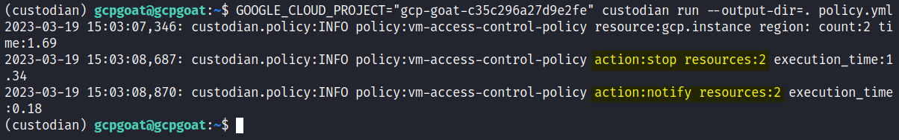

**Step 19:** Explore the resources.json file to get more details about the affected resources in the project.

**Command:**
```
cat vm-access-control-policy/resources.json
```

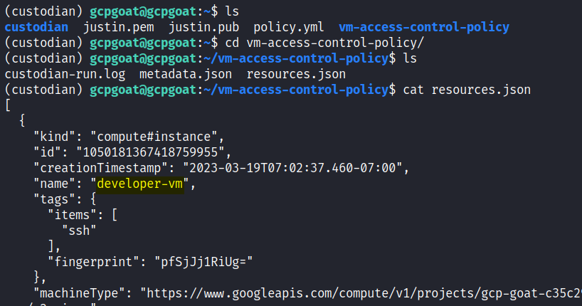

A Virtual machine named **developer-vm** is listed.

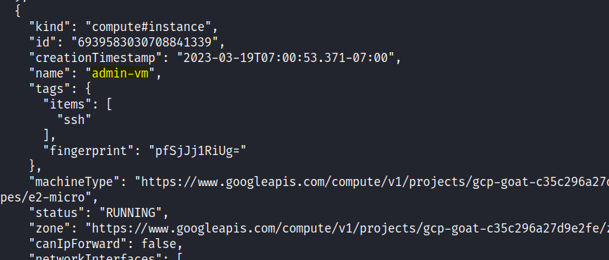

A Virtual machine named **admin-vm** is listed.

**Step 20:** Navigate back to GCP console and go to cloud functions page and click on the notification handler function.

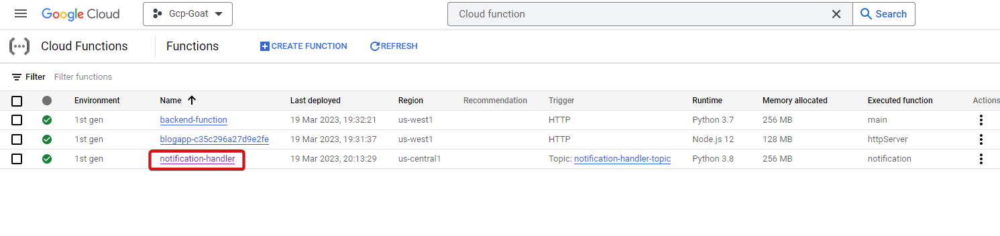

**Step 21:** Navigate to **Logs** tab and check the logs.

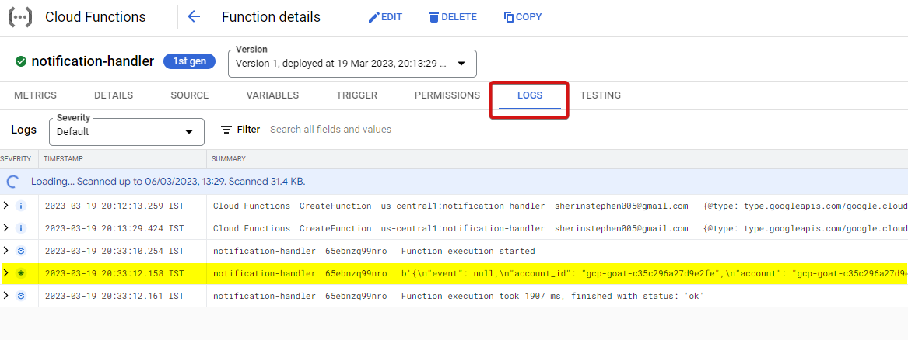

**Step 22:** We got the instances data and the message in the logs. 

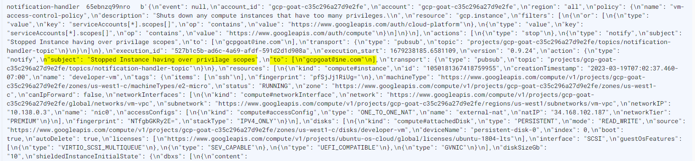

**Note:** We could also forward this data to the owner's email address for notification purposes.

**Step 23:** Search for **Compute** and navigate to **Compute Engine** page.


The list of virtual machines will show that all VMs have been stopped.

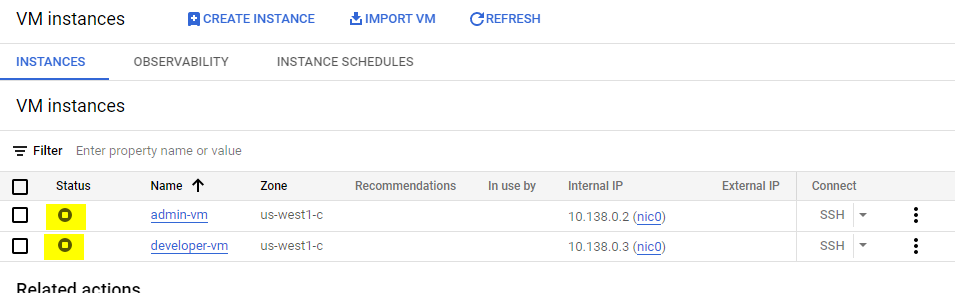

**Step 24:** Attempt to SSH into the virtual machine again.

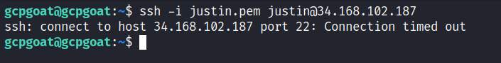

The excessive scopes issue in the virtual machine has been successfully addressed.

## References

- Cloud Custodian -  https://cloudcustodian.io/
- Cloud Custodian GCP Documentation - https://cloudcustodian.io/docs/gcp/gettingstarted.html
